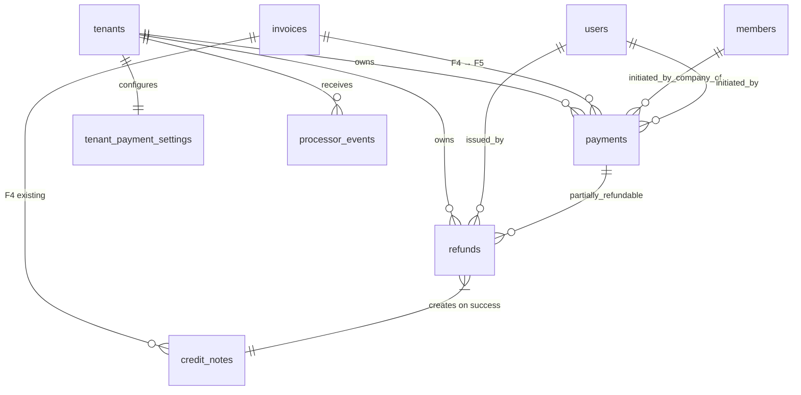

# F5 — Phase 1 Data Model

**Branch**: `009-online-payment`
**Date**: 2026-04-23
**Source**: `spec.md` FR-001…FR-026, `plan.md` § Storage + § Reliability, `research.md` § 4 + § 5 + § 7.
**Purpose**: concrete Postgres schema + Drizzle mapping + RLS + indexes + invariants + state machines for the 4 new F5 tables. `/speckit.tasks` uses this to emit migration + schema + repo + test tasks.

---

## 1. Conventions (inherited from F1–F4)

- **Money**: `amount_satang BIGINT` (Thai minor units; 1 THB = 100 satang). Never `NUMERIC`/`DECIMAL`/`FLOAT`. Mirrors F4's convention.
- **Timestamps**: `TIMESTAMPTZ` storing ISO 8601 UTC (Gregorian). Thai Buddhist Era is display-only in presentation.
- **Identifiers**: primary keys are `TEXT` ULIDs generated application-side (same F1+F2+F3+F4 pattern), **except** `processor_events.id` whose PK is the Stripe event id (a string like `evt_3MtwBwLkdIwHu7ix28a3tqPa`). Unique + naturally idempotent.
- **Tenant column**: `tenant_id TEXT NOT NULL REFERENCES tenants(id)` on every F5 table. RLS enforced via `USING (tenant_id = current_setting('app.current_tenant', TRUE))`.
- **Audit columns** (every F5 table): `created_at TIMESTAMPTZ NOT NULL DEFAULT now()`, `updated_at TIMESTAMPTZ NOT NULL DEFAULT now()` with a trigger to bump `updated_at` on UPDATE.
- **Soft delete**: NOT used in F5 — financial records are append-only + retention-immune.

---

## 2. Entity 1 — `payments`

One row per PaymentIntent attempt. An invoice may have multiple rows over time (retries after failure); exactly one may be in a terminal `succeeded`/`partially_refunded`/`refunded` state at any moment (enforced by a partial UNIQUE index, not just a domain invariant).

### 2.1 Columns

| Column | Type | Nullable | Notes |
|--------|------|----------|-------|
| `id` | `TEXT` | NO | PK; ULID |
| `tenant_id` | `TEXT` | NO | FK → `tenants(id)`; RLS |
| `invoice_id` | `TEXT` | NO | FK → `invoices(id)` (F4); FK is within tenant; cascade RESTRICT |
| `member_id` | `TEXT` | NO | FK → `members(id)` (F3); denormalised for admin filtering; must match `invoices.member_id` (CHECK) |
| `method` | `TEXT` | NO | ENUM-like: `'card'` \| `'promptpay'`; CHECK constraint |
| `status` | `TEXT` | NO | ENUM-like: `'pending'` \| `'succeeded'` \| `'failed'` \| `'canceled'` \| `'partially_refunded'` \| `'refunded'`; CHECK constraint |
| `amount_satang` | `BIGINT` | NO | > 0; equals `invoices.total_satang` at intent-creation time |
| `currency` | `TEXT` | NO | Always `'THB'` (CHECK) |
| `processor_payment_intent_id` | `TEXT` | NO | Stripe PaymentIntent id (`pi_…`); UNIQUE per row |
| `processor_charge_id` | `TEXT` | YES | Stripe Charge id (`ch_…` or `py_…`); populated on `payment_intent.succeeded` |
| `processor_environment` | `TEXT` | NO | ENUM-like: `'test'` \| `'live'`; CHECK; derived from Stripe event `livemode` at creation |
| `attempt_seq` | `INTEGER` | NO | 1-based counter per `invoice_id`; monotonically increasing; bumped on new PaymentIntent creation |
| `card_brand` | `TEXT` | YES | e.g. `'visa'`, `'mastercard'`; NULL for promptpay rows |
| `card_last4` | `TEXT` | YES | 4-digit string; NULL for promptpay; CHECK `length = 4` |
| `card_exp_month` | `SMALLINT` | YES | 1-12; NULL for promptpay |
| `card_exp_year` | `SMALLINT` | YES | 4-digit year; NULL for promptpay |
| `failure_reason_code` | `TEXT` | YES | Stripe decline code (e.g. `'card_declined'`, `'insufficient_funds'`); set only on `status='failed'` |
| `initiated_at` | `TIMESTAMPTZ` | NO | When the PaymentIntent was created |
| `completed_at` | `TIMESTAMPTZ` | YES | Settlement timestamp from Stripe; set when status leaves `pending` |
| `actor_user_id` | `TEXT` | NO | FK → `users(id)`; the member who initiated |
| `correlation_id` | `TEXT` | NO | Request correlation id; threaded through pino logs + OTel spans |
| `created_at` | `TIMESTAMPTZ` | NO | DEFAULT now() |
| `updated_at` | `TIMESTAMPTZ` | NO | DEFAULT now(); BEFORE UPDATE trigger |

### 2.2 Indexes

- `PRIMARY KEY (id)`
- `UNIQUE (processor_payment_intent_id)` — enforces idempotency + resume-on-reopen FR-003
- `INDEX (tenant_id, invoice_id, status)` — invoice → current payment lookup
- `INDEX (tenant_id, created_at DESC)` — admin payment list
- `INDEX (processor_charge_id)` — webhook lookup on `payment_intent.succeeded`
- `UNIQUE (tenant_id, invoice_id, status) WHERE status IN ('pending','succeeded','partially_refunded')` — **partial UNIQUE index** enforcing "at most one non-terminal Payment per invoice"; a new attempt after failure is permitted because the failed row is NOT in this index.

### 2.3 CHECK constraints

- `amount_satang > 0`
- `currency = 'THB'`
- `method IN ('card','promptpay')`
- `status IN ('pending','succeeded','failed','canceled','partially_refunded','refunded')`
- `processor_environment IN ('test','live')`
- `(method = 'card') = (card_brand IS NOT NULL AND card_last4 IS NOT NULL AND card_exp_month IS NOT NULL AND card_exp_year IS NOT NULL)` — card rows MUST have card metadata; promptpay rows MUST NOT.
- `(status != 'failed') OR (failure_reason_code IS NOT NULL)` — failed rows MUST carry a reason code
- `attempt_seq >= 1`
- `(completed_at IS NULL) = (status = 'pending')` — `pending` has no `completed_at`; any terminal status has it

### 2.4 RLS policies

```sql
ALTER TABLE payments ENABLE ROW LEVEL SECURITY;
ALTER TABLE payments FORCE ROW LEVEL SECURITY;

CREATE POLICY payments_tenant_isolation ON payments
  USING (tenant_id = current_setting('app.current_tenant', TRUE))
  WITH CHECK (tenant_id = current_setting('app.current_tenant', TRUE));
```

### 2.5 State machine (enforced in Domain, verified by tests)

```
            ┌─────────────────────────┐
            │                         │
            ▼                         │
        pending ──┬── succeeded ──┬──►│
            │     │               │
            │     ├── partially_refunded (loop on more partials)
            │     │               │
            │     └── refunded (terminal)
            │
            ├── failed (terminal)
            └── canceled (terminal)
```

- `pending` is the only initial state (row inserted on PaymentIntent creation).
- `pending → succeeded` on `payment_intent.succeeded` webhook.
- `pending → failed` on `payment_intent.payment_failed`.
- `pending → canceled` on `payment_intent.canceled` OR member-initiated cancel.
- `succeeded → partially_refunded` on first successful refund where cumulative sum < amount_satang.
- `partially_refunded → partially_refunded` on subsequent partials.
- `partially_refunded | succeeded → refunded` when cumulative refund sum equals amount_satang.
- `failed`, `canceled`, `refunded` are terminal — no transitions out.

---

## 3. Entity 2 — `refunds`

One row per refund attempt against a succeeded Payment. Multiple `succeeded` refunds per Payment are allowed (accumulating toward `amount_satang`).

### 3.1 Columns

| Column | Type | Nullable | Notes |
|--------|------|----------|-------|
| `id` | `TEXT` | NO | PK; ULID |
| `tenant_id` | `TEXT` | NO | FK → `tenants(id)`; RLS |
| `payment_id` | `TEXT` | NO | FK → `payments(id)`; within-tenant |
| `invoice_id` | `TEXT` | NO | Denormalised from Payment for index efficiency; CHECK: matches `payments.invoice_id` |
| `amount_satang` | `BIGINT` | NO | > 0; ≤ (`payment.amount_satang` − Σ prior succeeded refunds — enforced by FR-011b use-case, not SQL) |
| `reason` | `TEXT` | NO | Admin-entered; max 500 chars; sanitised (no newlines, HTML-escaped at render) |
| `status` | `TEXT` | NO | ENUM-like: `'pending'` \| `'succeeded'` \| `'failed'`; CHECK |
| `processor_refund_id` | `TEXT` | YES | Stripe Refund id (`re_…`); NULL until Stripe returns; UNIQUE when non-null |
| `failure_reason_code` | `TEXT` | YES | Stripe decline-like code; set only on `status='failed'` |
| `credit_note_id` | `TEXT` | YES | FK → `credit_notes(id)` (F4); NOT NULL when `status='succeeded'` (post-F4-call) |
| `initiated_at` | `TIMESTAMPTZ` | NO | When the refund row was inserted |
| `completed_at` | `TIMESTAMPTZ` | YES | When Stripe returned `status=succeeded|failed` |
| `initiator_user_id` | `TEXT` | NO | FK → `users(id)`; the admin |
| `correlation_id` | `TEXT` | NO | |
| `created_at` | `TIMESTAMPTZ` | NO | |
| `updated_at` | `TIMESTAMPTZ` | NO | |

### 3.2 Indexes

- `PRIMARY KEY (id)`
- `UNIQUE (processor_refund_id) WHERE processor_refund_id IS NOT NULL` — partial UNIQUE on non-null
- `INDEX (tenant_id, payment_id, status)` — remaining-refundable calculation
- `INDEX (tenant_id, invoice_id, status)` — admin invoice → refund history
- `INDEX (credit_note_id)` — FK → CN reverse lookup

### 3.3 CHECK constraints

- `amount_satang > 0`
- `status IN ('pending','succeeded','failed')`
- `(status = 'succeeded') = (processor_refund_id IS NOT NULL AND credit_note_id IS NOT NULL)`
- `(status = 'failed') = (failure_reason_code IS NOT NULL)`
- `(completed_at IS NULL) = (status = 'pending')`

### 3.4 RLS policies

Same pattern as `payments` — ENABLE + FORCE + tenant-scoped policy.

### 3.5 Invariant (FR-011b)

For any `payment_id`: `SUM(refunds.amount_satang WHERE status='succeeded') ≤ payments.amount_satang`.
- **NOT** enforced by a CHECK (would require a trigger that violates repo-level transaction semantics).
- Enforced by `issue-refund.ts` use-case: `SELECT … FOR UPDATE` on `payments(id)` before inserting the new `refunds` row, compute sum + new amount, reject if > payment.amount_satang. Concurrency-safe via row-level lock.

### 3.6 State machine

```
pending ──┬── succeeded (terminal)
          └── failed (terminal)
```

No retry; admin issues a new refund row for another attempt.

---

## 4. Entity 3 — `tenant_payment_settings`

One row per tenant. Configuration for F5's per-tenant policy.

### 4.1 Columns

| Column | Type | Nullable | Notes |
|--------|------|----------|-------|
| `tenant_id` | `TEXT` | NO | PK (one row per tenant); FK → `tenants(id)` |
| `processor` | `TEXT` | NO | ENUM-like; always `'stripe'` in F5; CHECK |
| `processor_environment` | `TEXT` | NO | `'test'` \| `'live'`; CHECK |
| `processor_account_id` | `TEXT` | NO | Stripe account id (public identifier); used by webhook handler for tenant resolution; NOT a secret |
| `processor_publishable_key` | `TEXT` | NO | Stripe publishable key (`pk_test_…` / `pk_live_…`); client-side by design; NOT a secret |
| `enabled_methods` | `TEXT[]` | NO | Subset of `['card','promptpay']`; CHECK: length ≥ 1 |
| `online_payment_enabled` | `BOOLEAN` | NO | Kill switch (FR-016 / SC-013); DEFAULT true |
| `auto_email_on_payment` | `BOOLEAN` | NO | Optional tenant override on receipt email; DEFAULT true |
| `promptpay_qr_expiry_seconds` | `INTEGER` | NO | Override for QR window; DEFAULT 900 (15 min); CHECK: 60 ≤ value ≤ 1800 |
| `allow_anonymous_paylink` | `BOOLEAN` | NO | **Forward-compat placeholder for F5.1 (FR-016a)**; DEFAULT false; no user-facing effect in F5 MVP |
| `created_at` | `TIMESTAMPTZ` | NO | |
| `updated_at` | `TIMESTAMPTZ` | NO | |

### 4.2 Indexes

- `PRIMARY KEY (tenant_id)`
- `UNIQUE (processor_account_id) WHERE processor IS NOT NULL` — webhook tenant-resolution lookup

### 4.3 CHECK constraints

- `processor IN ('stripe')`
- `processor_environment IN ('test','live')`
- `array_length(enabled_methods, 1) >= 1`
- `enabled_methods <@ ARRAY['card','promptpay']` — subset check
- `promptpay_qr_expiry_seconds BETWEEN 60 AND 1800`

### 4.4 RLS policies

Same pattern — ENABLE + FORCE + tenant-scoped policy.

### 4.5 Seed (migration 0036)

```sql
INSERT INTO tenant_payment_settings (
  tenant_id, processor, processor_environment, processor_account_id,
  processor_publishable_key, enabled_methods, online_payment_enabled
) VALUES (
  '<swecham_tenant_id>', 'stripe',
  CASE WHEN current_setting('app.env', TRUE) = 'production' THEN 'live' ELSE 'test' END,
  current_setting('app.stripe_account_id_swecham'),
  current_setting('app.stripe_publishable_key'),
  ARRAY['card','promptpay']::TEXT[], true
);
```

Values supplied via `psql` `\set` or a Node seed script reading Vercel env. Secret keys (secret_key, webhook_secret) are NOT stored in this row — they live in env vars only (Constitution Principle IV).

---

## 5. Entity 4 — `processor_events`

Append-only idempotency log for every webhook event processed. Natural PK = Stripe event id.

### 5.1 Columns

| Column | Type | Nullable | Notes |
|--------|------|----------|-------|
| `id` | `TEXT` | NO | PK; **Stripe event id** (e.g., `evt_…`); naturally unique |
| `tenant_id` | `TEXT` | YES | FK → `tenants(id)`; NULL ONLY for rejection-audit rows (env/api-version mismatch, unknown account) written by `insertRejectedProcessorEvent`. Successful events INSERT with the resolved tenant_id. The original "pre-resolution NULL → UPDATE" design (audit 2026-04-25) is unimplementable under the SELECT policy and was abandoned — see § 5.4 Reality check |
| `event_type` | `TEXT` | NO | Stripe event type (e.g., `'payment_intent.succeeded'`) |
| `api_version` | `TEXT` | NO | Stripe API version embedded in the event payload |
| `livemode` | `BOOLEAN` | NO | Stripe `livemode` flag; used for environment segregation (FR-010) |
| `processor_account_id` | `TEXT` | NO | Stripe account id on the event; used for tenant resolution |
| `received_at` | `TIMESTAMPTZ` | NO | Timestamp we received the webhook |
| `processed_at` | `TIMESTAMPTZ` | YES | Timestamp we finished processing (NULL if still in-flight / errored) |
| `outcome` | `TEXT` | NO | ENUM-like: `'processed'` \| `'acknowledged_only'` \| `'rejected_signature'` \| `'rejected_environment_mismatch'` \| `'rejected_api_version_mismatch'`; CHECK |
| `payload_sha256` | `TEXT` | NO | 64-char hex SHA-256 of the raw body; used for tamper detection audit |
| `correlation_id` | `TEXT` | NO | |
| `created_at` | `TIMESTAMPTZ` | NO | |

### 5.2 Indexes

- `PRIMARY KEY (id)` — also the idempotency primitive (FR-008)
- `INDEX (tenant_id, received_at DESC) WHERE tenant_id IS NOT NULL` — admin observability view
- `INDEX (processor_account_id, livemode, received_at DESC)` — debug/replay by account
- `INDEX (outcome, received_at DESC) WHERE outcome != 'processed'` — rejected-event audit view

### 5.3 CHECK constraints

- `outcome IN ('processed','acknowledged_only','rejected_signature','rejected_environment_mismatch','rejected_api_version_mismatch')`
- `payload_sha256 ~ '^[a-f0-9]{64}$'`
- `(outcome IN ('rejected_signature')) = (tenant_id IS NULL)` — rejected-signature rows NEVER bind a tenant (we never got past verification)

### 5.4 RLS policies

**Reality check (audit 2026-04-25)**: the original design described a "pre-resolution INSERT with NULL tenant_id → UPDATE to set tenant_id once resolved" flow. This flow was never implementable under the actual policies because PostgreSQL applies the SELECT policy USING clause as a visibility filter BEFORE the UPDATE policy is evaluated — and the strict SELECT (`tenant_id = current_setting`) hides NULL rows from every chamber_app context, so the UPDATE finds 0 rows.

**Production behaviour**: the webhook route resolves the tenant via `resolveTenantByProcessorAccountId` BEFORE entering `processWebhookEvent`, then INSERTs with the resolved tenant_id from the start. NULL-tenant rows ONLY appear via `insertRejectedProcessorEvent` for rejection-audit records (env mismatch, api-version mismatch, unknown-account `acknowledged_only`). Those rejection rows are system-level audit and are never promoted to a tenant — they remain invisible to all chamber_app contexts and are inspected out-of-band by the `neondb_owner` operator role.

```sql
ALTER TABLE processor_events ENABLE ROW LEVEL SECURITY;
ALTER TABLE processor_events FORCE ROW LEVEL SECURITY;

-- SELECT: strict tenant match. NULL-tenant rejection rows are
--         deliberately invisible to chamber_app — ops inspects them
--         via neondb_owner.
CREATE POLICY processor_events_select ON processor_events FOR SELECT
  USING (tenant_id = current_setting('app.current_tenant', TRUE));

-- INSERT: permits NULL tenant_id so the rejection-audit path
--         (insertRejectedProcessorEvent) can write env/api/unknown-
--         account rows. Successful events INSERT with tenant_id set.
CREATE POLICY processor_events_insert ON processor_events FOR INSERT
  WITH CHECK (tenant_id IS NULL OR tenant_id = current_setting('app.current_tenant', TRUE));

-- UPDATE: tenant-scoped only. The `OR tenant_id IS NULL` branch is
--         dead under chamber_app (SELECT policy hides NULL rows
--         before UPDATE evaluation) and is retained ONLY for owner-
--         role maintenance scripts that may run with row_security off.
CREATE POLICY processor_events_update ON processor_events FOR UPDATE
  USING (tenant_id = current_setting('app.current_tenant', TRUE) OR tenant_id IS NULL)
  WITH CHECK (tenant_id = current_setting('app.current_tenant', TRUE));

-- DELETE: forbidden (append-only idempotency log)
CREATE POLICY processor_events_no_delete ON processor_events FOR DELETE USING (false);
```

The admin observability view (US3) reads with a real tenant context so only that tenant's events are visible. NULL-tenant rejection records are excluded from every tenant-scoped view by design.

---

## 6. F4 schema extension (minimal)

F4's `credit_notes` table gains ONE new column on F5's branch (added via migration, not F4's branch):

| Column | Type | Nullable | Notes |
|--------|------|----------|-------|
| `source_refund_id` | `TEXT` | YES | FK → `refunds(id)`; NULL for F4-original (manual) credit notes; non-NULL for F5-origin credit notes |

Reverse lookup: `INDEX credit_notes(source_refund_id) WHERE source_refund_id IS NOT NULL`.

This lets the admin UI tell "F5-origin credit note" from "F4-manual credit note" in the timeline + the refund → CN link flows correctly.

---

## 7. Audit events emitted by F5

Logical schema (event payloads as stored in `audit_log.payload jsonb`):

| Event type | Required keys | Optional keys | Severity |
|-----------|---------------|---------------|----------|
| `payment_initiated` | `payment_id`, `invoice_id`, `method`, `amount_satang`, `processor_payment_intent_id`, `attempt_seq` | — | info |
| `payment_succeeded` | `payment_id`, `invoice_id`, `method`, `amount_satang`, `processor_charge_id`, `completed_at` | `card_brand`, `card_last4` | info |
| `payment_failed` | `payment_id`, `invoice_id`, `failure_reason_code` | `card_brand`, `card_last4` | info |
| `payment_canceled` | `payment_id`, `invoice_id`, `actor_type` (`'member'`\|`'webhook'`) | — | info |
| `payment_auto_refunded_stale_invoice` | `payment_id`, `invoice_id`, `refunded_amount_satang`, `cause` (`'invoice_voided'`\|`'invoice_credited'`\|`'invoice_already_paid'`) | — | warn |
| `payment_auto_refunded_concurrent_manual_mark` | `payment_id`, `invoice_id`, `refunded_amount_satang` | — | warn |
| `payment_environment_mismatch` | `processor_event_id`, `expected_livemode`, `actual_livemode` | — | high |
| `payment_cross_tenant_probe` | `subject_tenant_id`, `probing_actor_id`, `target_entity`, `target_id` | — | high |
| `refund_initiated` | `refund_id`, `payment_id`, `invoice_id`, `amount_satang`, `reason` | — | info |
| `refund_succeeded` | `refund_id`, `payment_id`, `invoice_id`, `processor_refund_id`, `credit_note_id`, `amount_satang` | — | info |
| `refund_failed` | `refund_id`, `payment_id`, `invoice_id`, `failure_reason_code` | — | warn |
| `out_of_band_refund_detected` | `processor_refund_id`, `processor_charge_id`, `amount_satang`, `runbook_url` | — | high |
| `webhook_signature_rejected` | `source_ip`, `user_agent`, `reason` (`'missing_header'`\|`'malformed'`\|`'bad_signature'`\|`'tampered_body'`) | — | high |
| `webhook_api_version_mismatch` | `processor_event_id`, `expected_version`, `actual_version` | — | warn |
| `tenant_payment_settings_updated` | `diff` (JSON patch), `actor_user_id` | — | info |
| `online_payment_toggled` | `new_value`, `actor_user_id` | — | info |

Retention: 5 years minimum; entries tied to F4 tax documents (refund_succeeded → credit_note_id) inherit F4's 10-year retention via shared legal-obligation basis.

### 7.1 Retention enforcement (post-critique E15, 2026-04-23)

The retention duration is encoded **per audit row** via a new column on `audit_log`:

| Column | Type | Nullable | Notes |
|--------|------|----------|-------|
| `retention_years` | `SMALLINT` | NO | DEFAULT 5; CHECK `retention_years IN (5, 10)` for F5; future features may extend the CHECK; populated by the audit-emitter at write time |

The F5 audit emitter (`src/modules/payments/infrastructure/audit/payments-audit.ts`) sets `retention_years` based on event type:

| Event type | `retention_years` | Rationale |
|-----------|-------------------|-----------|
| `refund_succeeded` (carries `credit_note_id`) | **10** | Touches F4 tax document — shared legal-obligation basis |
| `payment_succeeded`, `payment_failed`, `payment_canceled`, `payment_initiated` | 5 | Standard financial-record retention (Constitution Principle VIII) |
| `payment_auto_refunded_stale_invoice`, `payment_auto_refunded_concurrent_manual_mark` | 10 | Touches F4 tax document via auto-refund credit-note flow |
| `out_of_band_refund_detected` | 10 | Forensic record of CN-divergence event |
| `payment_environment_mismatch`, `payment_cross_tenant_probe` | 5 | Security audit, not financial |
| `webhook_signature_rejected`, `webhook_api_version_mismatch` | 5 | Operational/security audit |
| `tenant_payment_settings_updated`, `online_payment_toggled` | 5 | Configuration audit |
| `refund_initiated`, `refund_failed` | 5 | Operational audit; the corresponding `refund_succeeded` row carries the 10-year retention |
| `payment_initiate_rate_limited`, `payment_cancel_rate_limited` | 5 | Operational/security audit — forensic trail for 429 responses on payment routes (Threat F-09, migration 0043) |

F9 (GDPR export + retention enforcement, future feature) reads this column to apply the lifecycle policy. F5 just sets the flag; F9 enforces the purge job. Migration `0038_audit_log_add_retention_years.sql` adds the column with `DEFAULT 5` so existing rows are valid; F5's audit emissions explicitly set the column for every new row.

### 7.2 F4 inheritance — backfill mapping (post-critique R2-E4, 2026-04-23)

**Critical**: simply defaulting `retention_years=5` for existing F4 rows would silently downgrade tax-document audit events (Thai RD §87/3 + GDPR Art. 6(1)(c) require **10 years** for tax-document audit trails). Migration 0038 MUST include a backfill `UPDATE` for F4 event types that touch tax documents:

| F4 event type | Retention | Rationale |
|---------------|-----------|-----------|
| `invoice_issued` | **10** | Tax document creation — Thai RD §87/3 |
| `invoice_paid` | **10** | Tax document state change with receipt PDF generation — RD §87/3 |
| `invoice_voided` | **10** | Tax document terminal state with VOID-stamped PDF — RD §87/3 |
| `credit_note_issued` | **10** | Credit note is a separate Thai tax document — RD §86/10 |
| `invoice_pdf_resent` | **10** | Tax document delivery audit trail — RD §87/3 |
| `invoice_pdf_regenerated` | **10** | Tax document re-render audit (e.g., post-credit-note overlay) — RD §87/3 |
| `tenant_invoice_settings_updated` | 5 | Tenant configuration audit, not financial transaction |
| `pdf_render_failed` | 5 | Operational error log, not financial record |
| `auto_email_delivery_failed` | 5 | Operational error log |
| `invoice_cross_tenant_probe` | 5 | Security audit, not financial |
| `invoice_draft_created` | 5 | Draft is not yet a tax document; statutory clock starts on `invoice_issued` |
| (other F4 event types) | 5 | Default — not touching tax documents |

The migration MUST run the backfill UPDATE in the same transaction as the column addition (for atomicity):

```sql
-- 0038_audit_log_add_retention_years.sql
ALTER TABLE audit_log ADD COLUMN retention_years SMALLINT NOT NULL DEFAULT 5;
ALTER TABLE audit_log ADD CONSTRAINT audit_log_retention_years_chk
  CHECK (retention_years IN (5, 10));

-- Backfill F4 tax-document-touching event types to 10-year retention.
-- Without this, existing F4 audit rows would be incorrectly classified as 5-year
-- and F9's future purge job would prematurely delete tax-document audit trails
-- before the Thai RD §87/3 statutory minimum.
UPDATE audit_log
SET retention_years = 10
WHERE event_type IN (
  'invoice_issued',
  'invoice_paid',
  'invoice_voided',
  'credit_note_issued',
  'invoice_pdf_resent',
  'invoice_pdf_regenerated'
);
```

Verify the exact F4 event-type list against `specs/007-invoices-receipts/data-model.md` § Audit events before running the migration. Add the F5 event types from § 7 above to the same retention map at the audit-emitter layer (no migration needed for F5 rows because they're inserted post-migration with explicit `retention_years` value).

A dedicated integration test `tests/integration/payments/audit-retention-backfill.test.ts` MUST seed at least one row of each F4 + F5 event type, run migration 0038, and assert each row's `retention_years` matches the table above. This test is a Review-Gate blocker (compliance regression risk).

---

## 8. Migrations (chronological)

| File | Purpose |
|------|---------|
| `0032_create_payments.sql` | Create `payments` table + indexes + CHECK + RLS + FORCE + policy |
| `0033_create_refunds.sql` | Create `refunds` table + indexes + CHECK + RLS + FORCE + policy |
| `0034_create_tenant_payment_settings.sql` | Create `tenant_payment_settings` table + indexes + CHECK + RLS + FORCE + policy |
| `0035_create_processor_events.sql` | Create `processor_events` table + indexes + CHECK + RLS + FORCE + special policies (INSERT allows NULL tenant) |
| `0036_seed_swecham_payment_settings.sql` | Seed SweCham row with `enabled_methods = ['card','promptpay']` + `online_payment_enabled=true` |
| `0037_credit_notes_add_source_refund_id.sql` | Add `credit_notes.source_refund_id` nullable column + partial index |
| `0038_audit_log_add_retention_years.sql` | Add `audit_log.retention_years SMALLINT NOT NULL DEFAULT 5` + CHECK constraint (post-critique E15, 2026-04-23). **MUST include backfill `UPDATE` for F4 tax-document event types to `retention_years=10` per § 7.2** (post-critique R2-E4, 2026-04-23 — without backfill, F5 introduces a compliance regression in F4's existing audit trail by silently downgrading tax-document retention from indefinite-by-absence to 5 years). F5's audit emitter explicitly sets `retention_years` for every new row per § 7.1 mapping. F9 will enforce purge based on this column. Migration is atomic (column addition + backfill in single transaction). |

All migrations respect the F4 pattern: DDL in migration txn; `CREATE INDEX CONCURRENTLY` outside txn where needed; no blocking DDL on large existing tables; forward + backward compatibility during deployment.

---

## 9. ER diagram (Mermaid)



The ER diagram reinforces the dependency direction — F4 tables (`invoices`, `credit_notes`, `members`) are consumed by F5 tables, never the other way around.

---

## 10. Drizzle schema module

File: `src/modules/payments/infrastructure/schema.ts`

Exports:
- `payments` (`pgTable`)
- `refunds` (`pgTable`)
- `tenantPaymentSettings` (`pgTable`)
- `processorEvents` (`pgTable`)
- Relations (`relations()`) for `payments ↔ refunds ↔ credit_notes`
- Inferred types: `NewPayment`, `SelectPayment`, `NewRefund`, `SelectRefund`, etc. — consumed ONLY by Infrastructure (per Clean Architecture).

Domain types (`Payment`, `Refund`, `TenantPaymentSettings`, `ProcessorEvent`) live in `src/modules/payments/domain/**` and are not Drizzle-derived — they are constructed by Repository adapters from the SelectX DTOs.
