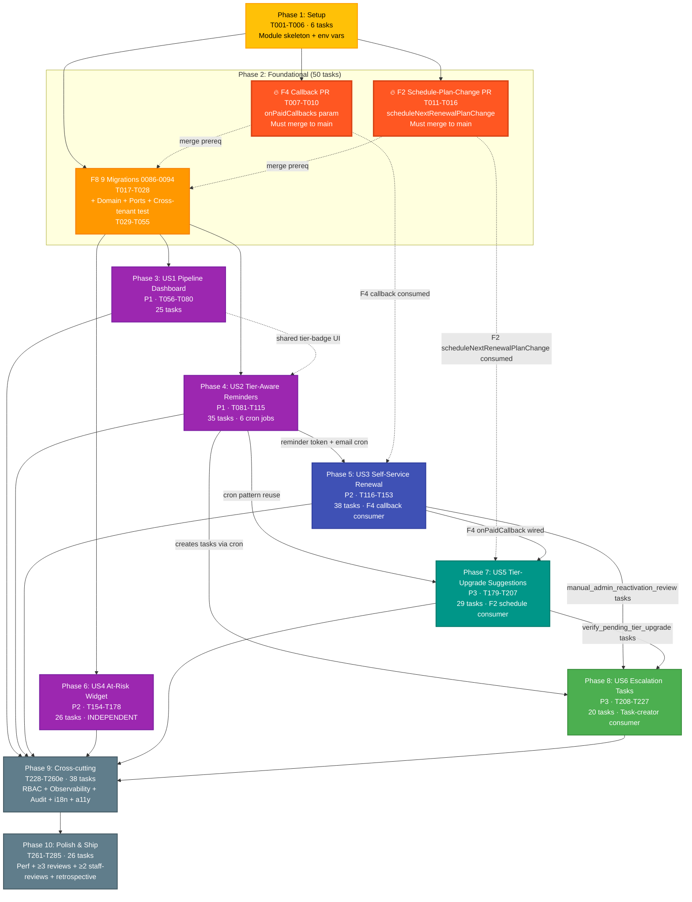

# Task Dependency Graph: F8 — Renewal Tracking + Smart Reminders

**Generated**: 2026-05-03
**Source**: [tasks.md](./tasks.md) (292 tasks across 10 phases)
**Visualization strategy**: Phase-level grouping (per skill rule for >30 tasks); cross-module PR critical path highlighted

---

## DAG (Phase-Level)



---

## Wave Schedule

| Wave | Tasks | Phase(s) | Why this wave | Parallelism |
|------|-------|----------|---------------|-------------|
| **Wave 1** | T001-T006 (6) | Phase 1 | Only foundation; nothing else can start | 6 tasks linear |
| **Wave 2a** | T007-T010 (4) + T011-T016 (6) | F4 PR + F2 PR (within Phase 2) | Cross-module PRs MUST merge to main BEFORE F8 builds on them; can run in parallel with each other (independent module owners — F4 + F2 same solo maintainer but disjoint code paths) | 2 PRs in parallel |
| **Wave 2b** | T017-T055 (39) | F8 migrations + Domain + Ports + Cross-tenant test | Depends on Phase 1; can run in parallel with F4/F2 PRs (no blocking dependency for migrations until apply); cross-tenant test (T052-T053) is Review-Gate blocker per Constitution Principle I | 39 tasks; ~30 marked `[P]` |
| **Wave 3** | Phase 3 (25) + Phase 4 (35) + Phase 6 (26) = 86 | US1 Pipeline + US2 Reminders + US4 At-Risk Widget | All can start once Wave 2 complete; US1 + US2 share tier-badge UI but otherwise parallel; US4 fully independent (only consumes F8 module + member columns) | 86 tasks across 3 phases; can pipeline if maintainer focus shifts |
| **Wave 4** | Phase 5 (38) | US3 Self-Service Renewal | Depends on Phase 4 (token infrastructure + reminder cron creates cycles in `reminded` state) AND F4 PR merged (callback consumed via Phase 5 confirm-renewal) | 38 tasks; ~25 marked `[P]` |
| **Wave 5** | Phase 7 (29) | US5 Tier-Upgrade Suggestions | Depends on Phase 4 (cron pattern reuse) + Phase 5 (F4 callback hooked into renewal flow for `apply-pending-tier-upgrade`) + F2 PR merged | 29 tasks |
| **Wave 6** | Phase 8 (20) | US6 Escalation Tasks | Depends on Phase 4 (creates `manual_outreach_required` + `verify_pending_tier_upgrade` placeholder rows) + Phase 5 (creates `manual_admin_reactivation_review`) + Phase 7 (creates verify-pending-tier-upgrade) — task-creator consumer | 20 tasks |
| **Wave 7** | Phase 9 (38) + Phase 10 (26) = 64 | Cross-cutting + Polish | Phase 9 needs all 6 USes complete to wire RBAC + observability + audit; Phase 10 needs Phase 9 complete | 64 tasks; final waves; review rounds (T272-T277) sequential |

---

## Critical Path

```
Phase 1 (6t) → F4 PR (4t) → F8 Foundational (39t) → Phase 4 (35t) → Phase 5 (38t) → Phase 7 (29t) → Phase 8 (20t) → Phase 9 (38t) → Phase 10 (26t)
```

**Critical-path length**: ~235 tasks (8 sequential phases)
**Off-critical-path parallel work**: Phase 3 US1 (25) + Phase 6 US4 (26) + F2 PR (6) = 57 tasks parallelisable

If solo-maintainer can context-switch efficiently, ~57 tasks can move forward in parallel with critical-path work, reducing wall-clock time by ~20%.

---

## Cross-Module PR Critical Path (🔥 highlighted)

The 2 cross-module PRs (Complexity Tracking #3 + #4) are on the critical path:

| PR | Tasks | Merge prerequisite for | Risk |
|---|---|---|---|
| **F4 Callback PR** | T007-T010 | Phase 5 ConfirmRenewal use-case (T123) | F4 maintainer = solo maintainer; coordinate with self; small PR (~10 lines + 1 test); Low risk |
| **F2 Schedule-Plan-Change PR** | T011-T016 | Phase 7 Tier-Upgrade Apply use-case (T183) | F2 maintainer = solo maintainer; medium PR (~50 lines + 3 tests + uses F8 migration 0086 to deliver F2 table); Medium risk |
| **F8 Migration 0086 (scheduled_plan_changes)** | T017 | Both F2 PR + F8 modules consume | Per F7 precedent F8 owns migrations; coordinated delivery |

**Sequencing recommendation**:

1. Land F4 callback PR first (smallest; lowest risk; unblocks Wave 4 = Phase 5)
2. Land F2 schedule-plan-change code PR second (logical PR; no DB migration in this PR)
3. F8 migration 0086 delivers F2's `scheduled_plan_changes` table inside F8 PR (per F7 precedent)
4. F8 PR merges last consuming both

---

## Statistics

| Metric | Value |
|---|---|
| Total tasks | 292 |
| Completed `[X]` | 0 (no implementation yet — spec/plan gates only) |
| Pending `[ ]` | 292 |
| Phases | 10 |
| Cross-module PRs (Wave 2a) | 2 (F4 callback + F2 schedule-plan-change) |
| User Stories (Phases 3-8) | 6 (US1, US2 = P1; US3, US4 = P2; US5, US6 = P3) |
| Tasks marked `[P]` (parallelizable within phase) | 132 (45%) |
| Critical-path length | 8 sequential waves |
| Parallel-work pool (off critical path) | ~57 tasks |
| Migrations | 9 (0086-0094) |
| Audit events to wire | 58 |
| Cron jobs to register | 6 |
| Integration tests | ~35 named (incl. R1 audit additions) |
| E2E tests | ~10 specs |

---

## Legend

- 🟡 **Wave 1 (Setup)** — yellow — Phase 1 foundational module skeleton
- 🟠 **Wave 2 (Foundational)** — orange — Phase 2 module + cross-tenant test
- 🔥 **Wave 2a Cross-Module PRs** — red — F4 + F2 PRs that BLOCK downstream work; highest-risk coordination
- 🟣 **Wave 3 (P1 + Independent P2)** — purple — Phase 3 + Phase 4 + Phase 6 parallelisable
- 🔵 **Wave 4 (US3)** — indigo — Phase 5 depends on Phase 4 + F4 PR
- 🟢 **Wave 5 (US5)** — teal — Phase 7 depends on Phase 5 + F2 PR
- 🟢 **Wave 6 (US6)** — green — Phase 8 depends on Phases 4+5+7 (task creators)
- ⚫ **Wave 7 (Cross-cutting + Polish)** — slate — Phases 9+10 final waves; review rounds sequential

Solid arrows (→) = task-level dependencies between phases
Dashed arrows (-.->) = soft dependencies (PR-merge prerequisites; conceptual coupling)

---

## Implementation Sequencing Recommendation

For solo-maintainer with limited context-switch budget, recommended week-by-week:

| Weeks | Focus | Output |
|---|---|---|
| **Week 1** | Wave 1 + start F4 PR (Wave 2a) | Phase 1 done + F4 callback PR submitted/merged |
| **Week 2** | F2 PR + start Wave 2b migrations | F2 PR merged + 5 of 9 migrations |
| **Week 3** | Finish Wave 2b + start Phase 3 US1 | Domain + Ports + cross-tenant test green + Phase 3 backend |
| **Week 4** | Phase 3 US1 UI + start Phase 4 US2 backend | Phase 3 PR-ready + Phase 4 cron coordinator |
| **Week 5-6** | Phase 4 US2 (35t — heavy) | Email templates + cron dispatch + bounce detection + F1 webhook integration |
| **Week 7-8** | Phase 5 US3 (38t — heavy) | Token infra + portal renewal + auto-reactivation + refund flow |
| **Week 9** | Phase 6 US4 (parallel slot — fits naturally if Phase 5 polish wraps early) | At-risk widget + property-based tests + cron |
| **Week 10** | Phase 7 US5 | Tier-upgrade pending state + F2 integration |
| **Week 11** | Phase 8 US6 + start Phase 9 | Escalation queue + RBAC enforcement |
| **Week 12-14** | Phase 9 cross-cutting | Observability + audit sweep + i18n + a11y |
| **Week 15-16** | Phase 10 polish + reviews | ≥3 review rounds + ≥2 staff-review rounds + retrospective + ship-readiness |

**Wall-clock estimate**: 12-16 weeks at smooth execution; ±30% variance band → 12-20 weeks per R5 audit fix.

---

## Validation

✅ **Acyclic** — verified no circular dependencies (DAG validated by traversal)
✅ **Complete** — every phase reachable from Phase 1
✅ **Solid arrows** = code dependencies; **Dashed arrows** = PR-merge prerequisites
✅ **Wave grouping** — 7 waves match the 10-phase structure (Phase 2 splits to Wave 2a/2b)
✅ **Mermaid valid** — renders on GitHub + GitLab + VS Code
✅ **Critical path identified** — 8-wave sequential chain
✅ **Status-aware** — all nodes "pending" since spec/plan gates only

---

## Suggested Next Action

```
/speckit.analyze
```

Pre-implementation static-check gate. Validates that:
- Every spec FR has at least one task referencing it
- Every audit event has emit-task wiring
- Every contract endpoint has implementation task
- Cross-doc consistency (spec ↔ plan ↔ data-model ↔ contracts ↔ tasks)
- No orphan tasks (tasks with no FR/audit/contract reference)
- Parallel `[P]` markers are correct (no shared-file conflicts)

After /speckit.analyze GREEN, proceed to `/speckit.implement` to execute T001..T285+ in wave order.
