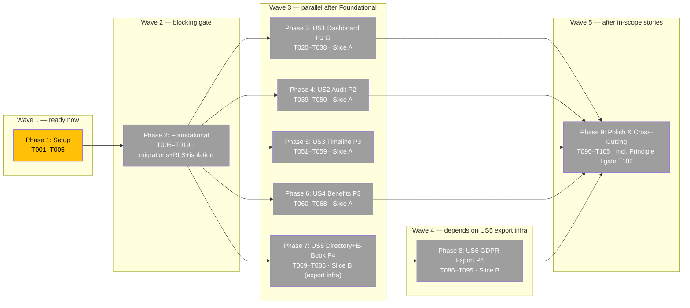

# Task Dependency Graph: F9 — Admin Dashboard + Directory + Timeline + Audit

**Source**: `specs/015-admin-dashboard/tasks.md` (105 tasks, 9 phases)
**Generated**: 2026-05-25 · **Read-only artifact** (regenerate via `/speckit.diagram.dependencies`)

> 105 tasks (>30) → grouped at the **phase level** with inter-phase edges, plus a
> task-level critical-path view.

## Phase-level DAG (execution waves)

## Critical path (task-level — longest chain)

```mermaid
flowchart LR
    T006["T006 0185 cache table"] --> T010["T010 0189 timeline view"]
    T010 --> T012["T012 apply+integration"]
    T012 --> T069["T069 private-blob adapter"]
    T069 --> T070["T070 export-job state machine"]
    T070 --> T071["T071 processExportJob worker"]
    T071 --> T089["T089 requestDataExport (US6)"]
    T089 --> T090["T090 GDPR archive builder"]
    T090 --> T091["T091 audit-subset redaction"]
    T091 --> T092["T092 wire gdpr kind"]
    T092 --> T102["T102 cross-tenant gate GREEN"]
    T102 --> T104["T104 full CI"]
    T104 --> T105["T105 security co-sign"]

    style T006 fill:#FFC107,color:#000
    style T010 fill:#FFC107,color:#000
    style T012 fill:#FFC107,color:#000
```

**Critical path**: T006 → T010 → T012 → T069 → T070 → T071 → T089 → T090 → T091 → T092
→ T102 → T104 → T105 (**~13 sequential tasks**). Slice B (US5→US6 serial, sharing export
infra) is the schedule driver, not Slice A.

## Legend
- 🟡 Yellow — ready (deps met, not done)
- ⚪ Gray — blocked (waiting on upstream phase)
- 🟢 Green — completed (none yet)

## Execution waves

| Wave | Phase(s) | Can start when |
|------|----------|----------------|
| **1** | P1 Setup | now |
| **2** | P2 Foundational | Setup done — **blocks everything** |
| **3** | P3 US1 · P4 US2 · P5 US3 · P6 US4 · P7 US5 | Foundational done (5-way parallel if staffed) |
| **4** | P8 US6 | US5 export infra (T069–T073) done |
| **5** | P9 Polish | in-scope stories done |

## Statistics
- **Total tasks**: 105 · **Completed**: 0 (0%) · **Ready now**: Phase 1 (T001–T005) · **Blocked**: 100
- **Phases**: 9 · **Execution waves**: 5
- **No cycles detected** — valid DAG ✅
- **Max parallelism**: Wave 3 (US1–US4 + US5 = up to 5 stories concurrently after Foundational)
- **Schedule driver**: Slice B serial chain (US5 → US6) — US6 depends on US5's shared export infra (T069–T073)

### Notes
- Within each story phase, TDD forces a sub-ordering: **tests (RED) → domain → application → infrastructure → presentation**, so per-story tasks aren't fully parallel internally.
- **T019** (cross-tenant RED harness) and **T102** (cross-tenant GREEN) bracket the Principle I Review-Gate blocker.
- Single-developer order: P3→P4→P5→P6 (Slice A) then P7→P8 (Slice B).
